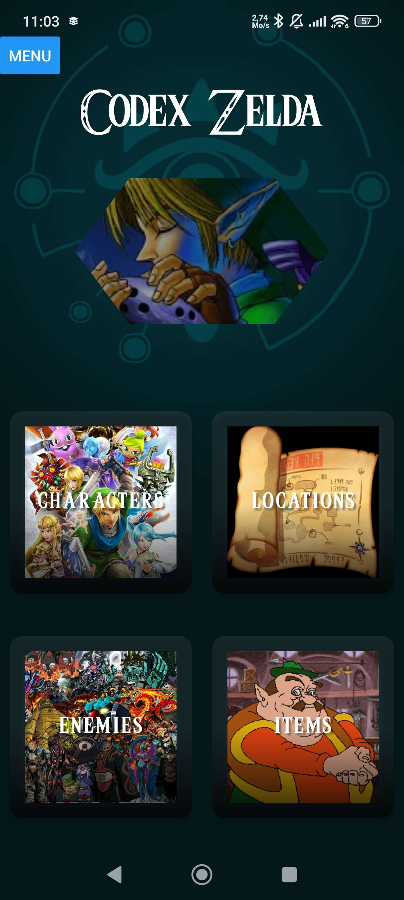
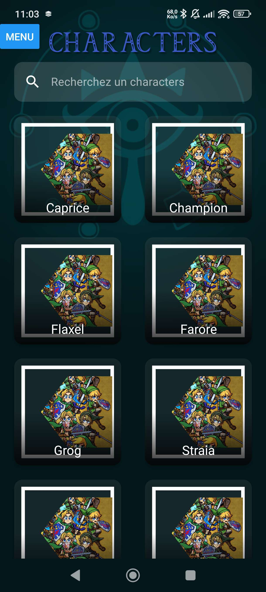
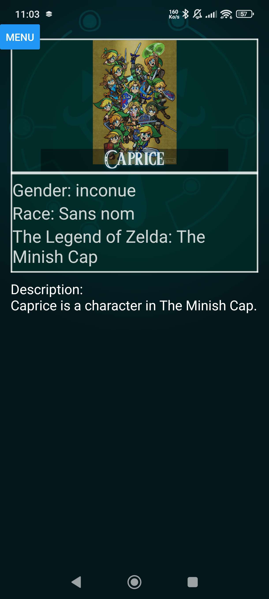

# 📘 Codex Zelda

[📌 Objectif](#-objectif) | [✨ Fonctionnalités](#-fonctionnalités) | [🔗 API](#-api) | [🛠️ Stack technique](#-stack-technique) | [🚀 Installation](#-installation--lancement) | [📁 Structure](#-structure-du-projet) | [💡 Exemple d’usage](#-exemple-dusage) | [🛣️ Roadmap](#-roadmap--futures-améliorations) | [📷 Captures](#-captures-décran) | [👤 Auteurs](#-auteurs)

  

---

## 🎯 Objectif

Codex Zelda permet de consulter facilement des informations issues d’une API dédiée : personnages, objets, boss…
Navigation simple en trois pages : sélection d’une catégorie, liste filtrable, puis fiche détaillée.

---

## ✨ Fonctionnalités

### 🏠 Page d’accueil

* Choix de la catégorie (personnages, items, boss…)
* Navigation intuitive

### 📄 Page de liste

* Récupération des données depuis l’API
* Affichage avec **FlatList** et **pagination**
* Barre de recherche insensible à la casse

### 👤 Page de détails

* Affichage des informations complètes d’un élément
* Données en temps réel fournies par l’API

---

## 🔗 API

Endpoint principal :

```
https://zelda.fanapis.com/api/
```

Exemple de requête :

```http
GET https://zelda.fanapis.com/api/characters
```

---

## 🛠️ Stack technique

* **React Native**
* **Expo**
* **Expo Router** pour la navigation
* Composants custom : Background, Header, Search…

---

## 🚀 Installation & lancement

```bash
# Installer les dépendances
npm install

# Lancer le projet
npx expo start

# Si le lancement classique ne fonctionne pas
npx expo start --tunnel
```

---

## 📁 Structure du projet

### `/app`

```
.
├── Example.tsx
├── Home.tsx
├── _layout.tsx
└── wiki_bis.tsx
```

### `/components`

```
.
├── Background/
│   └── Background.tsx
├── examplescroll.tsx
├── examplewiki.tsx
├── fetch.tsx
├── Header/
│   ├── header.tsx
│   └── H-style.tsx
├── Search.tsx
├── TwoUrlexample.tsx
└── wiki/
    ├── Bosses.tsx
    ├── charactere.tsx
    └── Items.tsx
```

### `/types`

```
.
├── freakyjorys.types.ts
└── navigation.ts
```

---

## 💡 Exemple d’usage

1. Ouvrir l’app
2. Cliquer sur une catégorie
3. Choisir "Personnages"
4. Rechercher "Link"
5. Voir la fiche détaillée

---

## 🛣️ Roadmap / futures améliorations

* Ajouter les favoris
* Mode sombre
* Ajout d’images pour les éléments
* Amélioration du CSS et de l’UI

---

## 📷 Captures d’écran





---

## 👤 Auteurs

* **Johnny Sassiat**
* **Jorys Pephily**
* **Gabriel Pieds**

---

### 🇬🇧 English Version – Codex Zelda

[📌 Objective](#-objective) | [✨ Features](#-features) | [🔗 API](#-api-1) | [🛠️ Tech Stack](#-tech-stack) | [🚀 Installation](#-installation) | [📁 Project Structure](#-project-structure) | [💡 Usage Example](#-usage-example) | [🛣️ Roadmap](#-roadmap) | [📷 Screenshots](#-screenshots) | [👤 Authors](#-authors)

---

## 🎯 Objective

Codex Zelda is a mini-wiki app inspired by *The Legend of Zelda*, allowing easy access to information about characters, items, and bosses.
Navigation is simple: category selection, filterable list, then detailed view.

---

## ✨ Features

### 🏠 Home Page

* Select a category (characters, items, bosses…)
* Intuitive navigation

### 📄 List Page

* Fetch data from the API
* Display with **FlatList** and **pagination**
* Search bar (case-insensitive)

### 👤 Detail Page

* Display full information about an item
* Real-time data from the API

---

## 🔗 API

Main endpoint:

```
https://zelda.fanapis.com/api/
```

Example request:

```http
GET https://zelda.fanapis.com/api/characters
```

---

## 🛠️ Tech Stack

* **React Native**
* **Expo**
* **Expo Router** for navigation
* Custom components: Background, Header, Search…

---

## 🚀 Installation

```bash
# Install dependencies
npm install

# Start the project
npx expo start

# If normal start fails
npx expo start --tunnel
```

---

## 📁 Project Structure

### `/app`

```
.
├── Example.tsx
├── Home.tsx
├── _layout.tsx
└── wiki_bis.tsx
```

### `/components`

```
.
├── Background/
│   └── Background.tsx
├── examplescroll.tsx
├── examplewiki.tsx
├── fetch.tsx
├── Header/
│   ├── header.tsx
│   └── H-style.tsx
├── Search.tsx
├── TwoUrlexample.tsx
└── wiki/
    ├── Bosses.tsx
    ├── charactere.tsx
    └── Items.tsx
```

### `/types`

```
.
├── freakyjorys.types.ts
└── navigation.ts
```

---

## 💡 Usage Example

1. Open the app
2. Click on a category
3. Choose "Characters"
4. Search "Link"
5. View the detailed page

---

## 🛣️ Roadmap / Future Improvements

* Add favorites
* Dark mode
* Add images for items
* UI/CSS enhancements

---

## 📷 Screenshots


---

## 👤 Authors

* **Johnny Sassiat**
* **Jorys Pephily**
* **Gabriel Pieds**

